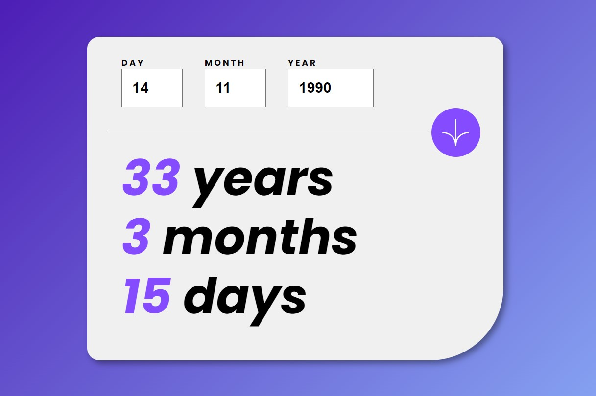

# Frontend Mentor - Age calculator app solution

This is a solution to the [Age calculator app challenge on Frontend Mentor](https://www.frontendmentor.io/challenges/age-calculator-app-dF9DFFpj-Q). Frontend Mentor challenges help you improve your coding skills by building realistic projects. 

## Table of contents

- [Overview](#overview)
  - [The challenge](#the-challenge)
  - [Screenshot](#screenshot)
  - [Links](#links)
- [My process](#my-process)
  - [Built with](#built-with)
  - [What I learned](#what-i-learned)
  - [Continued development](#continued-development)
  - [Useful resources](#useful-resources)
- [Author](#author)
- [Acknowledgments](#acknowledgments)


## Overview

### The challenge

Users should be able to:

- View an age in years, months, and days after submitting a valid date through the form
- Receive validation errors if:
  - Any field is empty when the form is submitted
  - The day number is not between 1-31
  - The month number is not between 1-12
  - The year is in the future
  - The date is invalid e.g. 31/04/1991 (there are 30 days in April)
- View the optimal layout for the interface depending on their device's screen size
- See hover and focus states for all interactive elements on the page
- **Bonus**: See the age numbers animate to their final number when the form is submitted

### Screenshot as of February 29, 2024




### Links

- Solution URL:  [Github repository](https://github.com/memominguez/age-calculator)
- Live Site URL:  [Github pages](https://memominguez.github.io/age-calculator/)

## My process

### Built with

- HTML5 markup
- CSS custom properties
- Flexbox
- CSS Grid
- Vanilla Javascript
- gsap animation library


### What I learned

- Care must be taken with the Javascript "new Date(year, month, date)". Non-valid input returns inaccurate results. Some ideas obtained through ChatGPT for checking date validity.
- Had to find out about the gsap animation library. This was successfully applied in this application.
- Had to find out the AGE calculation method.

The code snippet below is for checking a past date validity. It is actually 3 lines of code. It returns true or false. 

```js

function isValidPastDate(year, month, date) {
  // Create a Date object with the provided year, month, and date
  // Note: Month is zero-based in JavaScript Date objects (0 - January, 11 - December)
  const inputDate = new Date(year, month - 1, date);

  // Create a new Date object for today's date
  const today = new Date();

  // The new Date() constructor might cheat us!!
  // Check if the date/month values is a valid combination
  // The returned inputDate above must match the user input value  
  // Also check that the input must be a past date
  return inputDate.getDate() == date && inputDate < today;
}
```


### Continued development

Continue improving my coding skills by developing challenging applications, like this one.

### Useful resources (video tutorials)

- [Age calculator example](https://www.youtube.com/watch?v=_pw8vk1tAhs) - I adapted the age calculation method shown in this tutorial.
- [GSAP tutorial](https://www.youtube.com/watch?v=m6PDUIF24v4) - An introduction to the use of GSAP library for animations with javascript.


## Author


- Website - [Guillermo Dominguez](https://gdominguez-portfolio.netlify.app)
- Frontend Mentor - [@memominguez](https://www.frontendmentor.io/profile/memominguez)


## Acknowledgments


Thanks to all those who share their knowledge, free of charge, through video tutorials in the youtube platform.
 
